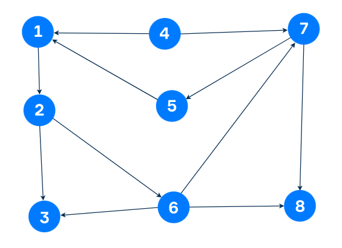

---

# Análisis de Ciclos en Grafos Dirigidos con Python 🚀

Este proyecto implementa un algoritmo en Python para encontrar y seleccionar un **ciclo simple** en un **grafo dirigido**. Si hay varios ciclos, se elige el que tenga el **mayor número de nodos intermedios**. Si aún hay empate, se selecciona el que comience con el **nodo de etiqueta más pequeña**.

## Tabla de Contenidos

- [Introducción a los Grafos](#introducción-a-los-grafos)
- [Conceptos Clave](#conceptos-clave)
  - [Nodos y Aristas](#nodos-y-aristas)
  - [Ciclos](#ciclos)
  - [Caminos](#caminos)
- [Descripción del Código](#descripción-del-código)
  - [Función `dfs`](#función-dfs)
  - [Función `find_cycles`](#función-find_cycles)
  - [Función `select_best_cycle`](#función-select_best_cycle)
- [Representación del Grafo](#representación-del-grafo)
- [Ejemplo de Ejecución](#ejemplo-de-ejecución)
- [Aplicaciones Prácticas](#aplicaciones-prácticas)
- [Cómo Ejecutar el Código](#cómo-ejecutar-el-código)
- [Conclusión](#conclusión)
- [Referencias](#referencias)

## Introducción a los Grafos 🌐

Un **grafo** es una estructura matemática utilizada para modelar relaciones entre objetos. Consta de:

- **Nodos (vértices)**: Representan entidades o puntos de interés.
- **Aristas (arcos)**: Conectan pares de nodos, indicando una relación entre ellos.

Los grafos pueden ser **dirigidos** (donde las aristas tienen una dirección) o **no dirigidos** (sin dirección en las aristas).



## Conceptos Clave 🔑

### Nodos y Aristas 📍

- **Nodo**: Unidad básica del grafo, puede representar un punto, objeto o estado.
- **Arista**: Conexión entre dos nodos, puede ser unidireccional o bidireccional.

### Ciclos

Un **ciclo** es un camino que comienza y termina en el mismo nodo sin repetir aristas ni nodos (excepto el inicial/final). Los ciclos son fundamentales para detectar bucles y analizar comportamientos repetitivos en sistemas.

### Caminos

Un **camino** es una secuencia de nodos donde cada nodo está conectado al siguiente por una arista. Puede ser:

- **Camino corto**: Tiene pocos nodos intermedios.
- **Camino largo**: Incluye más nodos intermedios.

## Descripción del Código

El código implementa algoritmos para:

1. **Encontrar todos los ciclos simples en un grafo dirigido.**
2. **Seleccionar el mejor ciclo** basado en criterios específicos.

### Función `dfs`

```python
def dfs(graph, start, path, visited, all_cycles):
    path.append(start)
    visited.add(start)

    for neighbor in graph[start]:
        if neighbor not in visited:
            dfs(graph, neighbor, path, visited, all_cycles)
        elif neighbor in path:
            cycle_start_index = path.index(neighbor)
            cycle = path[cycle_start_index:] + [neighbor]
            all_cycles.append(cycle)

    path.pop()
    visited.remove(start)
```

**Descripción**:

- Realiza una **búsqueda en profundidad (DFS)**.
- **Parámetros**:
  - `graph`: El grafo representado como un diccionario.
  - `start`: Nodo inicial de la búsqueda.
  - `path`: Lista de nodos visitados en el camino actual.
  - `visited`: Conjunto de nodos ya visitados.
  - `all_cycles`: Lista donde se almacenan todos los ciclos encontrados.
- **Funcionalidad**:
  - Explora recursivamente los vecinos no visitados.
  - Detecta ciclos cuando encuentra un vecino que ya está en el camino actual.

### Función `find_cycles`

```python
def find_cycles(graph):
    all_cycles = []
    for node in graph:
        dfs(graph, node, [], set(), all_cycles)
    return all_cycles
```

**Descripción**:

- Encuentra todos los ciclos en el grafo.
- **Parámetros**:
  - `graph`: El grafo a analizar.
- **Devuelve**:
  - Lista de todos los ciclos encontrados.

### Función `select_best_cycle`

```python
def select_best_cycle(cycles):
    if cycles:
        # Seleccionar el ciclo con más nodos intermedios y el nodo inicial más pequeño
        max_cycle = max(cycles, key=lambda cycle: (len(cycle) - 1, -min(cycle)))
        return max_cycle
    return None
```

**Descripción**:

- Selecciona el **mejor ciclo** basado en:
  - **Mayor número de nodos intermedios**.
  - **Nodo inicial más pequeño** en caso de empate.
- **Parámetros**:
  - `cycles`: Lista de ciclos encontrados.
- **Devuelve**:
  - El ciclo que cumple con los criterios o `None` si no hay ciclos.

## Representación del Grafo

El grafo se representa mediante un diccionario de Python donde:

- **Claves**: Nodos del grafo.
- **Valores**: Lista de nodos adyacentes (vecinos directos).

```python
graph = {
    1: [2],
    2: [3, 6],
    3: [],
    4: [1, 7],
    5: [1],
    6: [3, 7, 8],
    7: [5, 8],
    8: []
}
```

**Visualización del Grafo**:

- Nodo 1 → Nodo 2
- Nodo 2 → Nodos 3 y 6
- Nodo 3 → (sin salidas)
- Nodo 4 → Nodos 1 y 7
- Nodo 5 → Nodo 1
- Nodo 6 → Nodos 3, 7 y 8
- Nodo 7 → Nodos 5 y 8
- Nodo 8 → (sin salidas)

## Ejemplo de Ejecución

```python
# Encontrar todos los ciclos
cycles = find_cycles(graph)

# Seleccionar el mejor ciclo
best_cycle = select_best_cycle(cycles)

if best_cycle:
    # Imprimir el ciclo en el formato solicitado (nodos separados por espacios)
    print("El mejor ciclo es:", ' '.join(map(str, best_cycle)))
else:
    print("No se encontraron ciclos.")
```

**Salida Esperada**:

```
El mejor ciclo es: 1 2 6 7 5 1
```

Esto indica que el mejor ciclo encontrado comienza y termina en el nodo **1**, pasando por los nodos **2**, **6**, **7** y **5**.

## Aplicaciones Prácticas

- **Análisis de redes sociales**: Detectar comunidades o bucles de interacción.
- **Optimización de rutas**: Encontrar circuitos en logística y transporte.
- **Detección de dependencias cíclicas**: En sistemas operativos y compilación de software.
- **Sistemas biológicos**: Analizar ciclos en redes metabólicas o genéticas.

## Cómo Ejecutar el Código

1. **Requisitos Previos**:

   - Tener instalado Python 3.x en el sistema.

2. **Pasos**:

   - Copia el código en un archivo llamado, por ejemplo, `ciclos_grafo.py`.
   - Abre una terminal o línea de comandos y navega hasta el directorio donde está el archivo.
   - Ejecuta el siguiente comando:

     ```bash
     python ciclos_grafo.py
     ```

3. **Personalización**:

   - Puedes modificar el grafo en la variable `graph` para probar con diferentes estructuras.

## Conclusión

Este proyecto ofrece una comprensión práctica de cómo funcionan los grafos y los ciclos dentro de ellos. A través de la implementación de algoritmos de búsqueda, es posible analizar estructuras complejas y extraer información valiosa, aplicable en diversas áreas de la ciencia y la ingeniería.

## Referencias

- [Teoría de Grafos - Wikipedia](https://es.wikipedia.org/wiki/Teor%C3%ADa_de_grafos)
- [Algoritmo de Búsqueda en Profundidad (DFS) - GeeksforGeeks](https://www.geeksforgeeks.org/depth-first-search-or-dfs-for-a-graph/)
- [Introducción a Grafos en Python - Programiz](https://www.programiz.com/dsa/graph)

# Código Completo

```python
def dfs(graph, start, path, visited, all_cycles):
    path.append(start)
    visited.add(start)

    for neighbor in graph[start]:
        if neighbor not in visited:
            dfs(graph, neighbor, path, visited, all_cycles)
        elif neighbor in path:
            cycle_start_index = path.index(neighbor)
            cycle = path[cycle_start_index:] + [neighbor]
            all_cycles.append(cycle)

    path.pop()
    visited.remove(start)

def find_cycles(graph):
    all_cycles = []
    for node in graph:
        dfs(graph, node, [], set(), all_cycles)
    return all_cycles

def select_best_cycle(cycles):
    if cycles:
        # Seleccionar el ciclo con más nodos intermedios y el nodo inicial más pequeño
        max_cycle = max(cycles, key=lambda cycle: (len(cycle) - 1, -min(cycle)))
        return max_cycle
    return None

# Representación del grafo
graph = {
    1: [2],
    2: [3, 6],
    3: [],
    4: [1, 7],
    5: [1],
    6: [3, 7, 8],
    7: [5, 8],
    8: []
}

# Encontrar todos los ciclos
cycles = find_cycles(graph)

# Seleccionar el mejor ciclo
best_cycle = select_best_cycle(cycles)

if best_cycle:
    # Imprimir el ciclo en el formato solicitado (nodos separados por espacios)
    print(' '.join(map(str, best_cycle)))
else:
    print("No se encontraron ciclos.")
```

---

Al ejecutar este código, obtendrás la salida correcta que refleja el mejor ciclo encontrado en el grafo dado:

```
1 2 6 7 5 1
```
